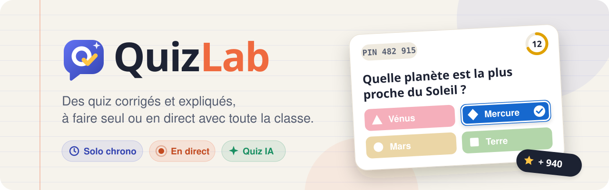
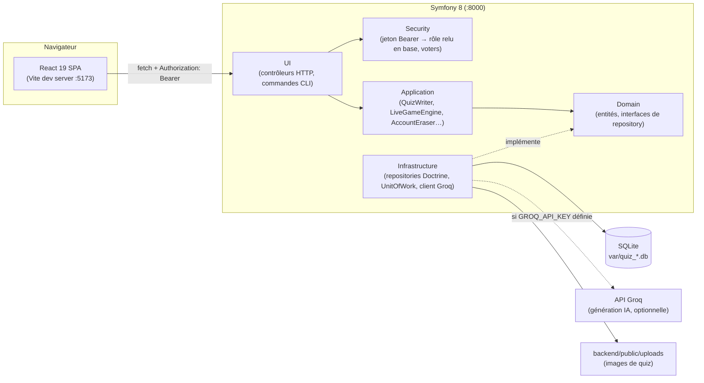

<div align="center">



# 🧠 QuizLab

**Quiz illustrés, parties solo chronométrées et parties en direct façon Kahoot**

[](https://www.php.net/)
[](https://symfony.com/)
[](https://react.dev/)
[](https://vitejs.dev/)
[](https://www.sqlite.org/)
[]()

</div>

---

Bibliothèque de quiz, création de questionnaires personnalisés, parties **solo**
chronométrées avec correction détaillée, et parties **en direct** (code PIN,
chrono, points selon la rapidité, podium). L'interface met en avant
l'**apprentissage** (bilans « à retenir » avec explications, parcours et maîtrise
par matière, quiz à retravailler) et la **classe** (page Communauté, classements,
nouveaux défis, auteurs). Thème clair façon cahier, polices **Fredoka** /
**Plus Jakarta Sans**, confettis CSS — sans dépendance externe pour l'UI.

## Sommaire

- [Stack technique](#stack-technique)
- [Architecture](#architecture)
- [Démarrer](#démarrer)
- [Rôles et connexion](#rôles-et-connexion)
- [Fonctionnalités](#fonctionnalités)
  - [Quiz par IA (chatbot)](#créer-un-quiz-par-ia-chatbot)
  - [Quiz personnalisés et images](#quiz-personnalisés-et-images)
  - [Partie en direct](#partie-en-direct-façon-kahoot)
- [Données personnelles (RGPD)](#données-personnelles-rgpd)
- [API](#api)
- [Structure du dépôt](#structure-du-dépôt)
- [Tests](#tests)
- [À suivre](#à-suivre)

## Stack technique

| Couche | Techno | Détail |
|---|---|---|
| **Backend** | Symfony 8.1 / PHP 8.4 | API JSON, architecture DDD par bounded context, DTO + `#[MapRequestPayload]`, Validator |
| **Persistance** | Doctrine ORM 3.7 + SQLite | migrations Doctrine, pas de SQL à la main |
| **Auth** | Symfony Security | jeton Bearer (empreinte SHA-256), rôle relu en base à chaque requête |
| **IA** | API Groq (compatible OpenAI) | génération de quiz, `symfony/http-client`, quota par clé + rate limiter |
| **Frontend** | React 19 + Vite 8 | SPA, `react-router-dom` 7 |
| **Lint** | oxlint | frontend |
| **Tests** | PHPUnit 13 | `WebTestCase` (fonctionnel HTTP) / `KernelTestCase` (service) |
| **CORS** | `nelmio/cors-bundle` | origines `localhost` / `127.0.0.1` en dev |
| **Conteneurs** | Docker Compose | une image backend (PHP 8.4), une image frontend (Node 24), lancées ensemble |

## Architecture



Le backend suit une architecture **DDD** : le code est découpé en **bounded
contexts**, chacun organisé en quatre couches.

| Contexte | Périmètre |
|---|---|
| `Identity` | comptes, inscription / connexion, jetons, annuaire admin, RGPD (export, effacement, purge) |
| `Quiz` | rédaction des quiz, questions, images, droits d'édition (`QuizVoter`) |
| `Game` | parties solo : correction, historique, classements, statistiques |
| `Live` | parties en direct : PIN, déroulé, points, podium |
| `Access` | clés d'accès professeur / administrateur |
| `Ai` | clés IA et génération de quiz (port `AiQuizGenerator`, adaptateur Groq) |
| `Shared` | `UnitOfWork`, générateur de clés, gestion des erreurs JSON |

| Couche | Contenu | Règle |
|---|---|---|
| `Domain` | entités, interfaces de repository, exceptions métier | aucune dépendance aux services Doctrine (seuls les attributs de mapping) |
| `Application` | cas d'usage, normalizers, DTO partagés | passe par les interfaces de repository et `UnitOfWork`, jamais par l'`EntityManager` |
| `Infrastructure` | repositories Doctrine, sécurité, API Groq, stockage, fixtures | implémente les interfaces du domaine (`#[AsAlias]`) |
| `UI` | contrôleurs HTTP + DTO de requête, commandes CLI | fins : valident l'entrée, délèguent, formatent la réponse |

Les règles détaillées pour contribuer sont dans [`backend/AGENTS.md`](backend/AGENTS.md).

Pas de WebSocket pour les parties en direct : les écrans interrogent l'état
**toutes les secondes**. Simple, sans service supplémentaire, largement
suffisant pour une classe.

## Démarrer

```bash
# Backend — http://localhost:8000
cd backend
composer install
php bin/console doctrine:migrations:migrate   # crée / met à jour var/quiz_dev.db
php bin/console doctrine:fixtures:load        # jeu de démo complet (VIDE la base)
symfony server:start -d

# Frontend — http://localhost:5173
cd ../frontend
npm install
npm run dev
```

L'URL de l'API côté front se règle avec `VITE_API_URL` (défaut `http://localhost:8000`).

### Avec Docker

Sans PHP ni Node installés en local : chaque partie a sa **propre image**
(`backend/Dockerfile`, `frontend/Dockerfile`) et `compose.yaml`, à la racine, les
lance **ensemble** :

```bash
docker compose up --build        # frontend :5173, backend :8000
docker compose exec backend php bin/console doctrine:fixtures:load   # jeu de démo (VIDE la base)
docker compose down
```

Le code est monté dans les conteneurs (rechargement à chaud conservé). Au démarrage,
le backend installe les dépendances Composer si besoin et applique les migrations ;
la base SQLite reste dans `backend/var/`. `GROQ_API_KEY` se lit toujours dans
`backend/.env.local`.

## Rôles et connexion

De vrais comptes : **e-mail + mot de passe** (haché par le composant Security de
Symfony). À la connexion, le serveur remet un **jeton** que le navigateur
renvoie à chaque requête (`Authorization: Bearer …`). Le rôle est relu **en
base** à chaque requête : il ne peut plus être forgé côté client, et un
changement de rôle s'applique immédiatement.

| Rôle | Comment on l'obtient | Actions |
|---|---|---|
| **Joueur** | un compte, sans rien d'autre | parcourir la bibliothèque, jouer en solo, rejoindre une partie en direct via un code PIN, voir sa correction, les classements, son historique |
| **Professeur** | compte + **clé d'accès** professeur | + créer / modifier / supprimer ses propres quiz (images, chrono par question), animer une partie en direct |
| **Admin** | compte + **clé d'accès** admin | + modérer tous les quiz, émettre / attribuer / révoquer les clés, changer le rôle d'un compte, back-office |

Les droits sont vérifiés **côté serveur** (403), pas seulement masqués dans
l'interface. La correction est calculée côté serveur : les bonnes réponses ne
sont jamais envoyées au navigateur pendant une question.

Les clés se créent depuis le back-office (**Administration → Clés d'accès**), avec
un champ de recherche pour **attribuer directement** un rôle à un compte existant,
et une **expiration** facultative pour les codes à transmettre — ou en ligne de
commande :

```bash
cd backend
php bin/console app:access-key --list                       # clés existantes et leur état
php bin/console app:access-key prof --label="Mme Martin"    # nouvelle clé professeur
php bin/console app:access-key prof --expires=30            # clé professeur valable 30 jours
php bin/console app:access-key admin                        # nouvelle clé administrateur
```

### Back-office

**Administration** est un espace à part entière, une section par adresse :
**Vue d'ensemble** (`/admin`), **Comptes** (`/admin/comptes`), **Clés d'accès**
(`/admin/cles`), **Clés IA** (`/admin/cles-ia`) et **Parties** (`/admin/parties`).

Les trois listings se filtrent **côté serveur** — recherche libre, rôle, état —
et non dans le navigateur : l'API ne renvoie que les lignes qui correspondent, donc
l'écran tient quand la base grossit. Chaque clé porte un **état** unique
(active, attribuée, périmée, révoquée) sur lequel on peut filtrer.

## Fonctionnalités

### Créer un quiz par IA (chatbot)

Une **bulle de chat flottante**, affichée uniquement sur la page **Créer**
(`/create`) et réservée aux professeurs et administrateurs, permet de décrire un sujet en une phrase :
l'**API Groq** (gratuite) rédige les questions et le quiz est **publié
directement** dans la bibliothèque, prêt à jouer.

Avoir le rôle professeur ou admin ne suffit pas : la génération demande en
plus une **clé IA**, distincte de la clé d'accès :

- un **nombre fixe de générations** (5 par défaut, réglable par l'admin), non renouvelable ;
- liée à **un compte** (au premier qui saisit le code, ou directement par l'admin) ;
- **expiration** facultative (en jours) ;
- émise / révoquée depuis **Administration → Clés IA**.

**Activer la génération** (facultatif, désactivée par défaut) :

1. Créer une clé gratuite sur https://console.groq.com/keys
2. L'ajouter dans `backend/.env.local` : `GROQ_API_KEY=ta-clé`
3. Redémarrer le serveur

Le brouillon généré passe par **la même validation** qu'un quiz saisi à la
main (`QuizWriter`). Limite anti-abus : **15 générations/heure/compte**
(`ai_quiz_generation` dans `config/packages/rate_limiter.yaml`).

### Quiz personnalisés et images

Dans l'éditeur : une **image de couverture**, une **illustration** et un
**chrono** (5 s à 4 min) par question, 2 à 6 propositions, réordonnancement
des questions.

Images (JPEG, PNG, GIF, WebP, 5 Mo max) téléversées dans
`backend/public/uploads/` sous un nom aléatoire. Un quiz ne peut référencer
**que** ces chemins-là : aucune image chargée depuis un site tiers, donc
aucune fuite de l'adresse IP des joueurs.

### Partie en direct (façon Kahoot)

1. Le professeur clique **En direct** sur un quiz → un **code PIN** à 6 chiffres s'affiche.
2. Les joueurs vont sur **Rejoindre**, saisissent le code : pseudo dans la salle d'attente.
3. **Lancer la partie** : question, image et chrono sur l'écran de l'animateur ;
   chaque joueur répond avec des **tuiles de couleur et de forme** (▲ ◆ ● ■).
4. Clôture à la fin du chrono ou dès que tout le monde a répondu : répartition
   des réponses, bonne réponse, classement provisoire.
5. Après la dernière question : **podium**. Chaque joueur retrouve la partie
   et sa correction dans **Mes parties**.

**Points** : une bonne réponse rapporte de 1 000 (instantanée) à 500 (au dernier moment), une mauvaise 0.

## Données personnelles (RGPD)

| Principe | Mise en œuvre |
|---|---|
| **Information et consentement** | page **Confidentialité** (`/confidentialite`), case obligatoire à l'inscription, date/version enregistrées |
| **Minimisation** | e-mail, pseudo, mot de passe haché, parties — pas de nom, pas de date de naissance, aucun service tiers |
| **Accès et portabilité** | **Mon compte → Télécharger mes données** (JSON complet) |
| **Effacement** | **Mon compte → Supprimer mon compte** : compte, jetons, historique effacés ; quiz anonymisés |
| **Conservation** | jetons 30 j ; parties en direct 24 h ; comptes inactifs 3 ans — via `app:rgpd:purge` |
| **Sécurité** | mots de passe hachés, jetons en empreinte SHA-256, rôles vérifiés côté serveur |

```bash
php bin/console app:rgpd:purge            # --dry-run pour voir ce qui serait supprimé
```

> ⚠️ Avant une mise en ligne, compléter dans `frontend/src/pages/Privacy.jsx`
> le **responsable du traitement**, son **contact** et l'**hébergeur**.

## API

Toutes les routes sauf `register`, `login` et `logout` demandent
`Authorization: Bearer <jeton>`.

<details>
<summary><strong>Voir la liste complète des routes</strong></summary>

| Méthode | Route | Rôle |
|---|---|---|
| POST | `/api/register` | e-mail, pseudo, mot de passe, consentement (+ clé d'accès) → jeton |
| POST | `/api/login` | e-mail + mot de passe → jeton |
| POST | `/api/logout` | révoque le jeton |
| GET / DELETE | `/api/me` | mon compte / suppression (mot de passe requis) |
| POST | `/api/me/access-key` | saisir une clé d'accès |
| GET | `/api/me/export` | export de mes données (JSON) |
| GET | `/api/quizzes` | liste, filtres `search`, `category`, `mine` |
| GET | `/api/categories` | catégories existantes |
| GET | `/api/quizzes/{id}` | détail (`?withAnswers=1` réservé à l'auteur/admin) |
| POST / PUT / DELETE | `/api/quizzes[/{id}]` | création, édition, suppression (**prof / admin**) |
| POST | `/api/uploads` | téléverser une image, champ `image` (**prof / admin**) |
| POST | `/api/ai/quizzes` | créer et publier un quiz par IA (**prof / admin + clé IA**, 15/h) |
| GET / POST | `/api/ai-keys` | lister (filtres `search`, `status`) / générer une clé IA (**admin**) |
| DELETE | `/api/ai-keys/{id}` | révoquer une clé IA (**admin**) |
| POST | `/api/me/ai-key` | lier une clé IA à son compte |
| POST | `/api/quizzes/{id}/sessions` | partie solo : envoie les réponses, reçoit la correction |
| GET | `/api/quizzes/{id}/sessions` | classement des participants du quiz |
| POST | `/api/live-games` | créer une partie en direct (**prof / admin**) |
| GET | `/api/live-games/{pin}` | état de la partie (animateur ou joueur inscrit) |
| POST | `/api/live-games/{pin}/join` | rejoindre |
| POST | `/api/live-games/{pin}/next` | étape suivante (**animateur**) |
| POST | `/api/live-games/{pin}/answers` | répondre à la question en cours |
| DELETE | `/api/live-games/{pin}` | arrêter la partie (**animateur**) |
| GET | `/api/users` | annuaire des comptes, filtres `search`, `role` (**admin**) |
| PUT | `/api/users/{id}/role` | changer un rôle (**admin**) |
| GET / POST | `/api/access-keys` | lister (filtres `search`, `role`, `status`) / générer une clé, avec `expiresInDays` facultatif (**admin**) |
| DELETE | `/api/access-keys/{id}` | révoquer une clé (**admin**) |
| GET | `/api/sessions` | historique (`?all=1` pour un admin) |
| GET | `/api/sessions/{id}` | détail d'une session |
| GET | `/api/stats` | compteurs + classement |

</details>

## Structure du dépôt

```
projet/
├── compose.yaml             lance backend + frontend avec Docker
├── backend/                 Symfony 8 — API JSON
│   ├── Dockerfile           image de dev PHP 8.4 (+ docker/entrypoint.sh)
│   ├── src/
│   │   ├── Identity/        comptes, auth, RGPD
│   │   ├── Quiz/            rédaction des quiz, images
│   │   ├── Game/            parties solo, classements
│   │   ├── Live/            parties en direct
│   │   ├── Access/          clés d'accès prof / admin
│   │   ├── Ai/              clés IA, génération Groq
│   │   └── Shared/          UnitOfWork, erreurs JSON, générateur de clés
│   │       (dans chaque contexte : Domain/ · Application/ · Infrastructure/ · UI/)
│   ├── migrations/          schéma versionné (Doctrine Migrations)
│   └── tests/               PHPUnit — API (WebTestCase) + tests unitaires rangés par contexte
├── frontend/                 React 19 + Vite
│   ├── Dockerfile            image de dev Node 24
│   ├── public/               favicon.svg, banner.svg (bannière du README)
│   └── src/
│       ├── pages/            routes de l'app (Library, Editor, LiveHost…)
│       │   └── admin/         back-office (vue d'ensemble, comptes, clés, parties)
│       └── components/       widgets partagés (tableaux filtrables, chat IA, tuiles de jeu…)
```

## Tests

```bash
cd backend && php bin/phpunit   # comptes et RGPD, sécurité, rôles, quiz et images, parties en direct, IA
cd frontend && npm run lint && npm run build
```

## À suivre

- **Lecture vocale des quiz** : prévue, non implémentée. Le plus simple sera
  `speechSynthesis` (Web Speech API, native, sans coût) branché sur `Play.jsx`
  et `LiveHost.jsx`.
- **Modifier son e-mail ou son pseudo** depuis « Mon compte » (aujourd'hui :
  sur demande au contact indiqué dans la politique de confidentialité).
- **Mot de passe oublié** : demande un envoi d'e-mail (`symfony/mailer`).
