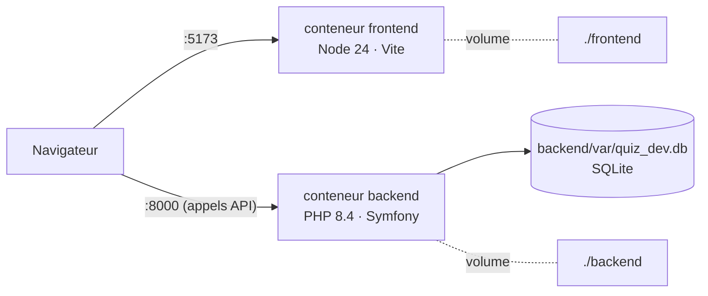

# Docker — formation express

Ce document explique ce qu'est Docker, pourquoi QuizLab l'utilise et comment s'en servir
au quotidien. Aucun prérequis : il faut seulement
[Docker Desktop](https://www.docker.com/products/docker-desktop/) installé et lancé.

---

## 1. Pourquoi Docker ?

Sans Docker, lancer QuizLab demande d'installer **PHP 8.4** (avec les extensions `intl` et
`zip`), **Composer**, **Node 24** et le **CLI Symfony**, dans les bonnes versions. Chaque
machine est un peu différente : « chez moi ça marche » devient vite un problème.

Docker règle ça en emballant chaque partie de l'application **avec tout ce dont elle a
besoin** (système, langage, extensions). Résultat :

- **une seule chose à installer** : Docker ;
- **même environnement pour tout le monde** : macOS, Windows ou Linux, les versions sont
  celles écrites dans les `Dockerfile` ;
- **rien ne pollue la machine** : on supprime les conteneurs, il ne reste rien ;
- **démarrage en une commande** pour un nouveau développeur ou un correcteur.

> Docker n'est pas une machine virtuelle : un conteneur partage le noyau du système hôte.
> Il démarre en une seconde et consomme peu de mémoire.

---

## 2. Les 4 notions à connaître

| Notion | En une phrase | Analogie |
|---|---|---|
| **Image** | Modèle figé : un système + les logiciels installés. Se construit à partir d'un `Dockerfile`. | La recette |
| **Conteneur** | Une image **en cours d'exécution**. On peut en lancer, arrêter, supprimer autant qu'on veut. | Le plat cuisiné |
| **Volume** | Dossier qui survit au conteneur, ou dossier de ta machine partagé avec lui. | Le frigo |
| **Port** | Ouverture entre ta machine et le conteneur (`8000:8000` = port hôte : port conteneur). | La porte |

Et deux fichiers :

- **`Dockerfile`** : décrit **comment construire une image** (une par service) ;
- **`compose.yaml`** : décrit **comment lancer plusieurs conteneurs ensemble** (ports,
  volumes, variables d'environnement, ordre de démarrage).

---

## 3. Comment c'est organisé dans QuizLab

```
QuizLab/
├── compose.yaml               lance les deux services ensemble
├── backend/
│   ├── Dockerfile             image PHP 8.4 + Composer
│   ├── .dockerignore          fichiers exclus de l'image (vendor, var, .env.local…)
│   └── docker/entrypoint.sh   script exécuté au démarrage du conteneur
└── frontend/
    ├── Dockerfile             image Node 24
    └── .dockerignore          node_modules, dist…
```

**Deux images séparées, un seul `compose.yaml`.** Chaque partie garde son propre
environnement (le backend n'a pas Node, le frontend n'a pas PHP), mais on les pilote
ensemble.



Les appels API partent **du navigateur**, pas du conteneur frontend : c'est pour ça que
`VITE_API_URL` vaut `http://localhost:8000` (le port ouvert sur ta machine).

### Le backend (`backend/Dockerfile`)

1. part de l'image officielle `php:8.4-cli` ;
2. installe les extensions `intl` et `zip` ;
3. copie Composer depuis l'image officielle `composer:2` ;
4. au démarrage, `entrypoint.sh` lance `composer install` si `vendor/` est absent, puis
   applique les **migrations Doctrine** ;
5. démarre le serveur PHP intégré sur le port 8000.

Les fixtures ne sont **pas** chargées automatiquement : elles vident la base.

### Le frontend (`frontend/Dockerfile`)

Part de `node:24-alpine` (image légère), relance `npm ci` seulement si `package-lock.json`
a changé, puis démarre Vite sur le port 5173 avec `--host 0.0.0.0` (sans ça, Vite
n'écoute qu'à l'intérieur du conteneur et le navigateur ne le voit pas).

### Deux astuces importantes du `compose.yaml`

- **Le code est monté, pas copié** (`./backend:/app`) : une modification dans ton éditeur
  est visible tout de suite dans le conteneur. Pas besoin de reconstruire l'image.
- **`node_modules` vit dans un volume à part** : les paquets compilés pour Linux (dans le
  conteneur) ne se mélangent pas avec ceux de macOS.

---

## 4. Les commandes du quotidien

Toutes se lancent **à la racine du projet** (là où se trouve `compose.yaml`).

```bash
# Démarrer (--build reconstruit les images si un Dockerfile a changé)
docker compose up --build
docker compose up -d              # en arrière-plan (-d = detached)

# Voir ce qui tourne et lire les logs
docker compose ps
docker compose logs -f backend    # -f = suivre en direct, Ctrl+C pour quitter

# Lancer une commande DANS un conteneur
docker compose exec backend php bin/console doctrine:fixtures:load   # jeu de démo (VIDE la base)
docker compose exec backend php bin/phpunit
docker compose exec backend php bin/console app:access-key --list
docker compose exec frontend npm run lint
docker compose exec backend sh    # ouvrir un terminal dans le conteneur

# Arrêter
docker compose down               # supprime les conteneurs, garde les volumes
docker compose down -v            # supprime AUSSI les volumes (cache Composer, node_modules)

# Un seul service
docker compose up backend
docker compose restart backend
```

**Quand faut-il `--build` ?** Uniquement si un `Dockerfile` ou `entrypoint.sh` a changé.
Pour du code PHP ou React, un simple `docker compose up` suffit.

---

## 5. Configuration et secrets

- `APP_SECRET` a une valeur de développement par défaut dans `compose.yaml`. On peut la
  remplacer via un fichier `.env` à la racine ou `APP_SECRET=... docker compose up`.
- La clé Groq (`GROQ_API_KEY`) se met toujours dans `backend/.env.local` : le dossier est
  monté, Symfony la lit comme d'habitude. Redémarrer le backend après modification.
- `.dockerignore` empêche d'embarquer `vendor/`, `node_modules/` et les `.env.local` dans
  les images : elles restent légères et **aucun secret ne finit dedans**.

---

## 6. Problèmes fréquents

| Symptôme | Cause probable | Solution |
|---|---|---|
| `port is already allocated` | Un serveur local tourne déjà sur 8000 ou 5173 | `symfony server:stop`, fermer `npm run dev`, ou changer le port hôte (`"8001:8000"`) |
| `Cannot connect to the Docker daemon` | Docker Desktop n'est pas lancé | Ouvrir Docker Desktop |
| Le front ne voit pas l'API (CORS / réseau) | Backend pas encore prêt (migrations en cours) | `docker compose logs backend`, attendre, recharger |
| Erreur après ajout d'un paquet npm | `node_modules` du volume pas à jour | `docker compose restart frontend` |
| Paquet Composer ajouté mais introuvable | `vendor/` existe déjà, l'install n'est pas relancée | `docker compose exec backend composer install` |
| Tout est cassé, on veut repartir de zéro | — | `docker compose down -v` puis `docker compose up --build` |

---

## 7. Pour aller plus loin

- **Ce setup est fait pour le développement.** En production on écrirait des images
  différentes : code **copié** dans l'image (pas monté), `composer install --no-dev`,
  front compilé (`npm run build`) et servi par Nginx, vrai serveur PHP (FrankenPHP ou
  PHP-FPM) au lieu du serveur intégré.
- **Build multi-étapes** (`FROM ... AS build`) : compiler dans une première image et ne
  garder que le résultat dans la finale, beaucoup plus légère.
- **Healthcheck** : aujourd'hui `depends_on` démarre le backend avant le front, mais
  n'attend pas qu'il soit prêt. Un `healthcheck` + `condition: service_healthy` le ferait.
- **Base de données** : passer de SQLite à PostgreSQL reviendrait à ajouter un service
  `database` (image `postgres`) dans `compose.yaml` et à changer `DATABASE_URL`.

Documentation officielle : [docs.docker.com/get-started](https://docs.docker.com/get-started/)
et [docs.docker.com/compose](https://docs.docker.com/compose/).
